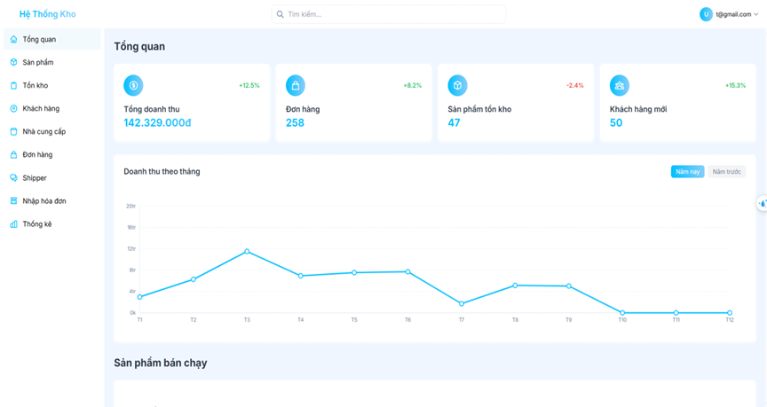

# XD_HTTQL - Hệ Thống Quản Lý Kho Hàng

## Giới thiệu



XD_HTTQL là hệ thống quản lý kho hàng hiện đại, hỗ trợ quản lý sản phẩm, tồn kho, nhập/xuất kho, đơn hàng, khách hàng, nhân viên, nhà cung cấp, shipper và thống kê doanh thu. Dự án gồm hai phần: **Backend** (Node.js, Express, Sequelize, MySQL) và **Frontend** (React, Vite, Redux, TailwindCSS).

---

## Cấu trúc thư mục

```
XD_HTTQL/
├── backend/         # Server API (Node.js, Express, Sequelize)
│   ├── src/
│   │   ├── controller/
│   │   ├── models/
│   │   ├── routers/
│   │   ├── services/
│   │   ├── migrations/
│   │   ├── seeders/
│   │   └── ...
│   ├── public/
│   ├── .env
│   └── package.json
├── frontend/        # Ứng dụng web (React, Vite, Redux, TailwindCSS)
│   ├── src/
│   │   ├── components/
│   │   ├── API/
│   │   ├── assets/
│   │   └── ...
│   ├── public/
│   ├── .env
│   └── package.json
└── README.md
```

---

## Yêu cầu hệ thống

- Node.js >= 16
- MySQL >= 8
- npm

---

## Cài đặt & Khởi động

### 1. Backend

```bash
cd backend
npm install
```

- Tạo file `.env` dựa trên `.env.example` và cấu hình thông tin database.
- Khởi tạo database & seed dữ liệu mẫu:
  ```bash
  npx sequelize-cli db:migrate
  npx sequelize-cli db:seed:all
  ```
- Chạy server backend:
  ```bash
  npm start
  ```
- Mặc định chạy ở `http://localhost:3001`

### 2. Frontend

```bash
cd frontend
npm install
```

- Tạo file `.env` dựa trên `.env example` (mặc định đã trỏ tới backend `http://localhost:3001`).
- Chạy ứng dụng web:
  ```bash
  npm run dev
  ```
- Truy cập tại `http://localhost:5173`

---

## Tính năng chính

- Quản lý sản phẩm, tồn kho, nhập kho, xuất kho
- Quản lý đơn hàng, nhân viên, khách hàng, nhà cung cấp, shipper
- Thống kê doanh thu, sản phẩm bán chạy, trạng thái đơn hàng
- Tìm kiếm, lọc, phân trang, xuất Excel
- Đăng nhập, phân quyền người dùng
- Giao diện hiện đại, responsive

---

## Một số lệnh hữu ích

- **Reset database:**
  ```bash
  npx sequelize-cli db:migrate:undo:all
  npx sequelize-cli db:migrate
  npx sequelize-cli db:seed:all
  ```
- **Chạy backend:**  
  `npm start`
- **Chạy frontend:**  
  `npm run dev`

---

## Tài liệu: https://sequelize.org/docs/v6/other-topics/migrations/
